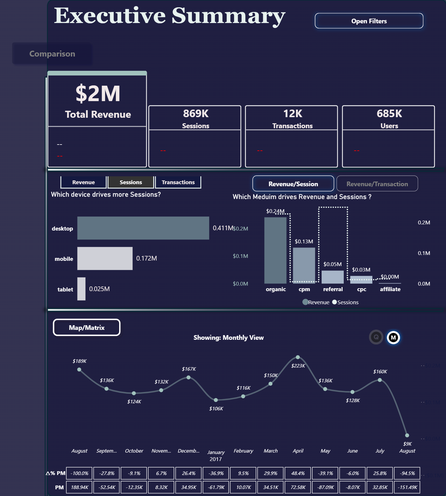
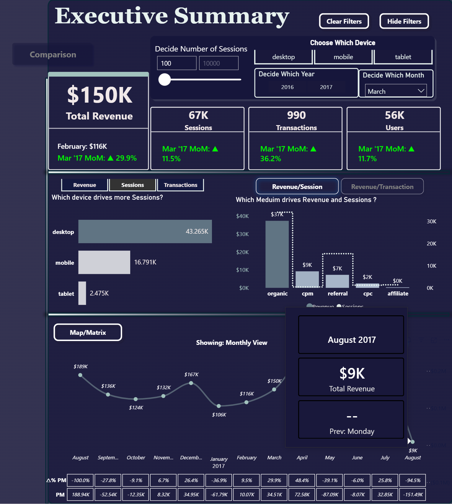
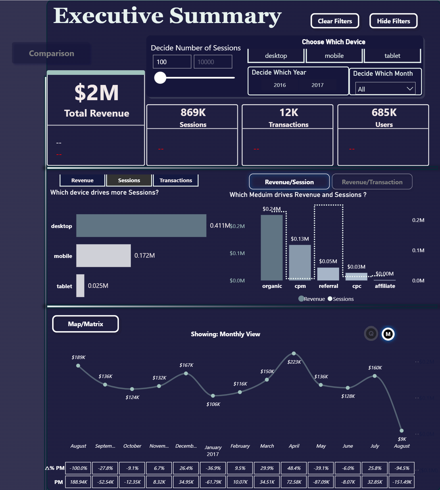
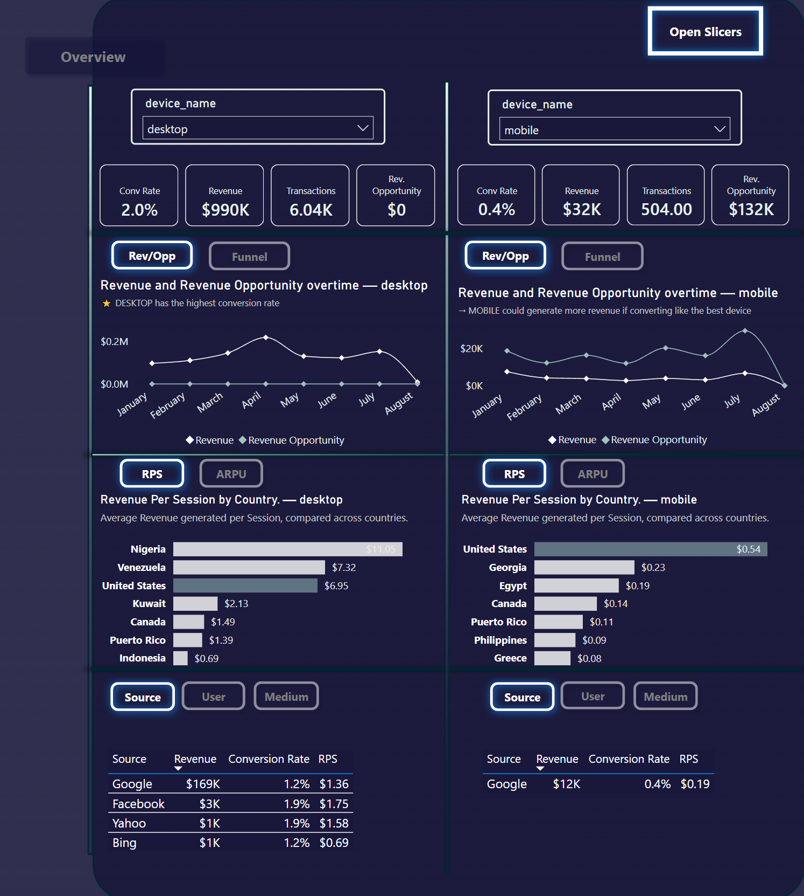
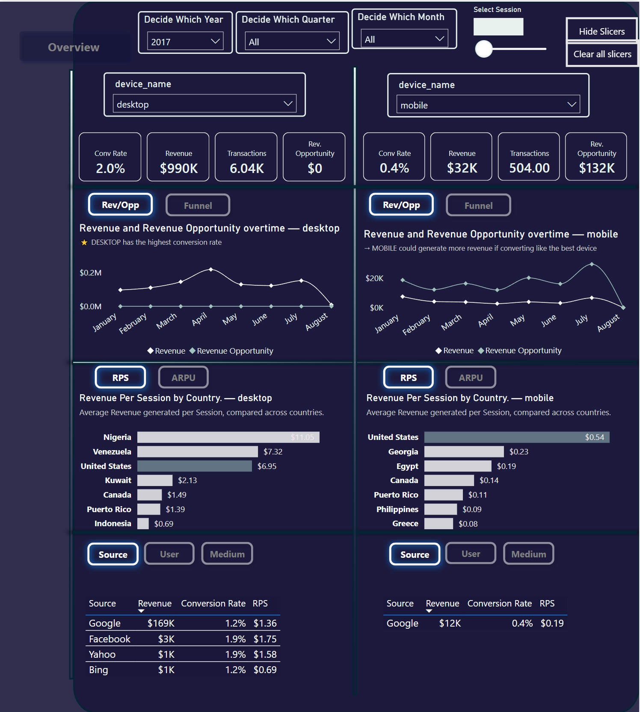

# E-commerce Analytics Pipeline: BigQuery SQL → Star Schema → Power BI

This project analyzes e-commerce performance using the Google Analytics
sample dataset stored in Google BigQuery. It follows a complete analytics
workflow — from raw data exploration in SQL to an interactive Power BI
dashboard — with the goal of understanding user behavior, channel
performance, device efficiency, and revenue opportunities.

---

## Dataset

The dataset used is the **Google Analytics Sample** public dataset
available on Google BigQuery:
```
bigquery-public-data.google_analytics_sample.ga_sessions_*
```

It contains obfuscated Google Analytics 360 data from the **Google
Merchandise Store**, covering sessions between **August 2016 and
August 2017**. Each row represents one session and includes information
about the user, device, geography, traffic source, and e-commerce
transactions.

| Property | Detail |
|---|---|
| Source | BigQuery Public Dataset |
| Coverage | August 2016 – August 2017 |
| Total Sessions | ~869K |
| Total Users | ~685K |
| Total Transactions | ~12K |
| Total Revenue | ~$2M |

---

## Workflow

1. Raw data explored directly in BigQuery
2. Business questions answered using SQL
3. Aggregated views created for performance optimization
4. Star schema data model built in BigQuery
5. Power BI connected via DirectQuery
6. DAX measures created for KPIs and time intelligence
7. Interactive dashboard built for business analysis
8. Business insights and revenue opportunities identified

---

## Project Structure
```
ecommerce-analytics-bigquery-powerbi/
│
├── README.md
│
├── sql/
│   ├── 01_create_views.sql          # daily_channel_metrics + customer_channel_metrics
│   ├── 02_overall_performance.sql   # Session, user, revenue, conversion trends
│   ├── 03_channel_performance.sql   # Volume, value, efficiency by channel
│   ├── 04_user_segmentation.sql     # New vs returning, device behavior
│   ├── 05_revenue_rps_arpu.sql      # RPS by device/channel, ARPU analysis
│   └── 06_star_schema.sql           # Fact + dimension table definitions
│
├── powerbi/
│   └── ecommerce_dashboard.pbix
│
├── images/
│   ├── data_model.png
│   ├── Summary_Overview_nf.png
│   ├── Summary_Overview_sf.png
│   ├── Summary_Overview_wf.png
│   ├── Comparison_nf.png
│   └── Comparison_wf.png
│
└── docs/
    └── insights.md
```

---

## Step 1 — SQL Analysis in BigQuery

Before building the data model, business questions were explored
directly in BigQuery using two aggregated views as the base:

- **daily_channel_metrics** — sessions, users, transactions, and revenue
  aggregated by date and traffic source/medium
- **customer_channel_metrics** — extends the above with device category
  and new/returning user segmentation

→ [`01_create_views.sql`](sql/01_create_views.sql)

---

### Business Questions Answered

**Overall Performance & Health**
→ [`02_overall_performance.sql`](sql/02_overall_performance.sql)
- How are sessions, users, transactions, and revenue evolving over time?
- What are the daily, weekly, and monthly conversion and revenue trends?
- Which days of the week perform best?

**Acquisition & Channel Performance**
→ [`03_channel_performance.sql`](sql/03_channel_performance.sql)
- Which channels generate the most sessions and users?
- Which channels generate the most revenue and transactions?
- Which channels convert best?
- Which channels deliver the highest value per session?

**User Behavior & Segmentation**
→ [`04_user_segmentation.sql`](sql/04_user_segmentation.sql)
- How do new vs returning users differ in behavior and value?
- How does performance differ across devices (desktop, mobile, tablet)?
- Is mobile underperforming across all channels or only specific ones?

**Revenue Efficiency**
→ [`05_revenue_rps_arpu.sql`](sql/05_revenue_rps_arpu.sql)
- Where is revenue per session (RPS) highest by device and channel?
- What is the average revenue per user (ARPU) by device?
- What is the revenue opportunity if conversion rates improved?

---

## Step 2 — Star Schema (BigQuery)

After SQL exploration, a star schema was built directly in BigQuery
to optimize performance and simplify reporting in Power BI.

→ [`06_star_schema.sql`](sql/06_star_schema.sql)


### Fact Table

**fact_session** — one row per session with metrics (sessions,
transactions, revenue) and foreign keys to all dimension tables.
Uses a FARM_FINGERPRINT surrogate key for city to handle duplicate
city names across regions.

### Dimension Tables

| Table | Description |
|---|---|
| `dim_date` | Calendar dimension with year, month, day name, and ISO day number (Monday = 1) |
| `dim_city` | City-level geography using a surrogate key to avoid name collisions |
| `dim_device` | Device category (desktop, mobile, tablet) |
| `dim_channel` | Traffic source/medium pairs with platform grouping (Google, Facebook, Bing, etc.) |
| `dim_country` | Country-level dimension, enrichable with ISO codes |
| `dim_users` | User type classification (new vs returning) with first and last session dates |

---

## Step 3 — Power BI Dashboard

Power BI was connected to BigQuery using **DirectQuery** mode, meaning
all queries run live against BigQuery without importing data.

### DAX Measures

| Group | Measures |
|---|---|
| Revenue | Total Revenue, Previous Month Rev, MoM Change, Running Revenue |
| Sessions | Total Sessions, Previous Month Session, MoM Change, Sessions Growth % |
| Transactions | Total Transactions, Previous Month Transaction, MoM Change |
| Users | Total Users, MoM Change, Users Growth % |
| KPIs | Conversion Rate, Revenue per Session (RPS), ARPU, Revenue Opportunity |
| Supporting | FunnelSteps, Selected Device (dynamic), What If parameter (session threshold) |

One DAX measure worth highlighting is `Funnel Value (Log)`, which
applies a LOG10 transformation to each funnel step metric:
```dax
Funnel Value (Log) = 
VAR RawValue =
    SWITCH(
        SELECTEDVALUE(FunnelSteps[StepName]),
        "Sessions", [Total Sessions],
        "Users", [Total Users],
        "Transactions", [Total Transactions],
        "Revenue", [Total Revenue]
    )
RETURN
IF(
    RawValue > 0,
    LOG(RawValue, 10),
    BLANK()
)
```

This compresses vastly different magnitudes onto a single readable
axis — similar to log scaling used in data normalization:

| Funnel Step | Raw Value | LOG10 |
|---|---|---|
| Sessions | ~869,000 | 5.94 |
| Users | ~685,000 | 5.84 |
| Transactions | ~12,000 | 4.08 |
| Revenue | ~$2,000,000 | 6.30 |

All four steps fall in the **4–7 range**, making them visually
comparable on the same chart axis without smaller values being
unreadable next to larger ones.

---

### Dashboard Pages

The dashboard contains **2 pages** with **6 analytical views**
accessible via toggles and slicers.

---

#### 1. Executive Summary


*Clean overview — no filters applied ($2M total revenue)*


*Filtered to March 2017 — MoM change indicators visible*


*Geographic section — Revenue by Country map + city tooltip + RPS matrix*

High-level overview of total revenue ($2M), sessions (869K),
transactions (12K), and users (685K) with month-over-month
change indicators.

**KPI Cards**
- Total Revenue, Sessions, Transactions, Users
- MoM % change with previous month value shown
  (e.g. Feb: $116K → Mar '17 MoM: ▲29.9% revenue, ▲36.2% transactions)

**Performance Section**
- Revenue, Sessions, and Transactions toggleable across device
  categories (desktop: 43K sessions, mobile: 17K, tablet: 2.5K)
- Revenue and Sessions by acquisition medium (organic, cpm, referral,
  cpc, affiliate) with Revenue/Session and Revenue/Transaction toggle
- Monthly revenue trend line with Lines/Change toggle and
  period-over-period delta table (ΔPM and PM rows)

**Geographic Section**
- Interactive world map showing Revenue by Country
  (TomTom, dark grayscale theme)
- City-level tooltip: Total Revenue, ARPU, Conversion Rate, and
  Sessions by city (e.g. New York: $24K revenue, Fort Collins: 115 ARPU)
- Countries with highest RPS matrix table across desktop, mobile,
  and tablet (top countries: Venezuela, United States, Switzerland,
  Spain, Saudi Arabia, Mexico, Japan, Indonesia, Hong Kong, Colombia,
  China, Canada)

*Filters: Year, Month, Device toggle (desktop/mobile/tablet),
Session range slider (100–10,000)*

---

#### 2. Comparison


*Rev/Opp view — Revenue vs Revenue Opportunity over time per device*


*Funnel view — each device's LOG10-scaled contribution to global
Sessions, Users, Transactions, and Revenue*

Side-by-side comparison of any two devices selected via dropdown.
Each panel includes four KPIs (Conversion Rate, Revenue, Transactions,
Revenue Opportunity) and switches between two analytical views:

**Rev/Opp View**
- Revenue vs Revenue Opportunity trend over time
- Highlights the gap between actual and potential revenue if the
  device converted at the best-performing device's rate
  (e.g. mobile revenue opportunity: $132K)

**Funnel View**
- Each device's % contribution to global Sessions, Users,
  Transactions, and Revenue
- Bar lengths are driven by a LOG10 transformation of each metric
  via DAX, compressing vastly different magnitudes (Sessions: 869K,
  Transactions: 12K, Revenue: $2M) onto a single readable axis —
  similar to log scaling used in data normalization
- Exposes drop-off between traffic share and revenue share
  (e.g. mobile drives 28.6% of sessions but only 3.1% of revenue)

**Channel & Geographic Breakdown (per device)**
- Revenue Per Session by Country (desktop top markets: Nigeria $11.05,
  Venezuela $7.32, US $6.95 — mobile: US $0.54)
- Source-level table (Revenue, Conversion Rate, RPS) switchable
  between Source, User, and Medium views
  (e.g. desktop Google: $169K revenue, 1.2% conv rate, $1.36 RPS)

*Filters: Year, Quarter, Month dropdowns, Session range slider*

---

## Key Business Insights

**Device Performance**
Desktop drives the majority of revenue with a 2.0% conversion rate,
while mobile accounts for 28.6% of all sessions but converts at only
0.4% — suggesting UX or checkout friction on mobile devices.

**Revenue Opportunity**
If mobile conversion improved to match desktop's rate, the business
could generate an estimated **$132K in additional revenue** without
increasing traffic at all.

**Channel Performance**
Organic search is the dominant medium at $0.24M in revenue, well ahead
of cpm ($0.13M) and referral ($0.05M). Some channels drive high session
volume but low conversion, indicating inefficient traffic acquisition.

**User Behavior**
Returning users convert at a higher rate and generate more revenue than
new users, highlighting the value of retention strategies and remarketing
over pure acquisition growth.

**Geographic Insights**
Desktop RPS is strongest in Nigeria ($11.05) and Venezuela ($7.32),
revealing high-value niche markets. Some regions show high traffic but
low RPS, which may point to localization, pricing, or payment method gaps.

**Overall Conclusion**
The core performance issue is not traffic volume but conversion
efficiency. Improving the mobile experience and optimizing
underperforming channels represent the clearest paths to meaningful
revenue growth.

---

## Architecture
```
Google Analytics Sample Data (BigQuery Public Dataset)
                    ↓
            SQL Exploration
         (business questions)
                    ↓
       Aggregated Views (BigQuery)
    daily_channel_metrics
    customer_channel_metrics
                    ↓
        Star Schema (BigQuery)
     fact_session + 6 dim tables
                    ↓
    Power BI — DirectQuery Mode
                    ↓
         DAX Measures & KPIs
                    ↓
       Interactive Dashboard
                    ↓
         Business Insights
```

## 🌐 Live Report

👉 [**Click here to view the interactive dashboard on Power BI Online**](https://app.powerbi.com/groups/me/reports/e9620d7a-0bfb-43e0-a895-2085ab21c69f/c194e3542183c297a483?experience=power-bi&bookmarkGuid=ea12eb5f7f471214b45d)

📧 [Email](peter.j.nwachineke@gmail.com)

💼 [Connect with me on LinkedIn](https://www.linkedin.com/in/peter-j-nwachineke-819291247/)
